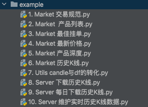
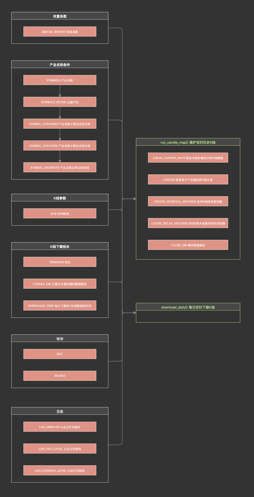
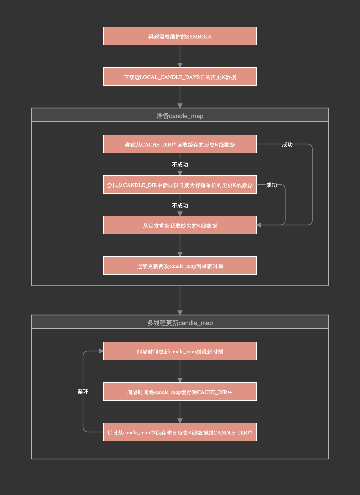

# Binance_candle v1.0.4

## 1 Binance_candle的设计目的？

**1.为本地模拟交易提供历史数据**

- 支持现货、U本位合约、币本位合约历史K线下载、管理与快速读取。

**2.为实盘交易决策依据**

- 支持现货与合约产品实时最新历史K线数据的缓存更新
- 获取实时行情数据

## 2 安装Binance_candle


```cmd
pip3 install binance_candle
```

GITHUB：https://github.com/pyted/binance_candle

里面有Binance_candle的使用例子：



## 3 快速开始

### 3.1 维护产品实时历史K线数据candle_map

以U本位产品为例，运行run_candle_map函数后，会以多线程的方式维护candle_map属性，保证candle_map的时效性。

candle_map的格式：candle_map[\<symbol:str\>] = \<candle:np.ndarray\>

```python
from binance_candle import CandleServer

candleServer = CandleServer('UM') # UM：U本位合约
candleServer.run_candle_map()
print(candleServer.candle_map)
```

输出：

```text
>> {
>>     '1000LUNCBUSD': array(
>>         [[1.67496882e+12, 1.74100000e-01, 1.74100000e-01, ...,
>>           7.31000000e+03, 1.27199670e+03, 0.00000000e+00],
>>          [1.67496888e+12, 1.74000000e-01, 1.74200000e-01, ...,
>>           1.90710000e+04, 3.31999150e+03, 0.00000000e+00],
>>          [1.67496894e+12, 1.74200000e-01, 1.74200000e-01, ...,
>>           3.23500000e+03, 5.63537000e+02, 0.00000000e+00],
>>          ...,
>>          [1.67514144e+12, 1.66000000e-01, 1.66000000e-01, ...,
>>           1.00560000e+04, 1.66929600e+03, 0.00000000e+00],
>>          [1.67514150e+12, 1.65800000e-01, 1.65800000e-01, ...,
>>           3.56710000e+04, 5.91068840e+03, 0.00000000e+00],
>>          [1.67514156e+12, 1.65700000e-01, 1.65800000e-01, ...,
>>           7.88270000e+04, 1.30688056e+04, 0.00000000e+00]]
>>     ),
>>     ... ... 
>> }
```

### 3.2 每日定时下载历史K线

以现货交易为例，每天定时下载前一天的历史K线数据。

```python
from binance_candle import CandleServer

candleServer = CandleServer('SPOT') # SPOT：现货交易
candleServer.download_daily()
```

### 3.3 获取实时最优挂单价格

以币本位合约为例，获取实时最优挂单价格

```python
from binance_candle import CandleServer

candleServer = CandleServer('CM') # CM：币本位合约
bookTickerMap = candleServer.market.get_bookTickersMap()
print(bookTickerMap)
```

输出：

```text
>> {
>>      'code': 200,
>>      'data': {'AAVEUSD_PERP': {'askPrice': '81.300',
>>                                'askQty': '92',
>>                                'bidPrice': '81.260',
>>                                'bidQty': '42',
>>                                'pair': 'AAVEUSD',
>>                                'symbol': 'AAVEUSD_PERP',
>>                                'time': 1675143719137},
>>               'ADAUSD_230331': {'askPrice': '0.37198',
>>                                 'askQty': '100',
>>                                 'bidPrice': '0.37170',
>>                                 'bidQty': '30',
>>                                 'pair': 'ADAUSD',
>>                                 'symbol': 'ADAUSD_230331',
>>                                 'time': 1675143718074},
>>               ... ...
>>               }
>>      'msg': ''
>> }
```

## 4 历史K线candle的数据说明

### 4.1 K线的格式

为了保证运算的速度，candle采用np.ndarray类型存储。

|列索引|字段解释|例子|
|:---|:---|:---|
|0|K线开盘时间|1499040000000.0|
|1|开盘价|0.01634790|
|2|最高价|0.80000000|
|3|最低价|0.01575800|
|4|收盘价|0.01577100|
|5|成交量|148976.11427815|
|6|K线收盘时间|1499644799999.0|
|7|成交额|2434.19055334|
|8|成交笔数|308.0|
|9|主动买入成交量|1756.87402397|
|10|主动买入成交额|28.46694368|
|11|<官方解释为可忽略的参数>|17928899.62484339|

官方返回的字段类型包含整数和字符串，但对于历史K线数据，binance_candle中均以np.float64作为存储格式。

注：Python对于数字精度的支持并不优秀，对于模拟运算或者实盘决策，使用浮点数是安全的，但对于交易接口，例如下单的数量和金额，采用字符串类型更为安全，在全部pyted的量化交易架构中，与订单相关的数字对象均采用字符串用于提交。

### 4.2 K线的存储规则

本地历史K线数据是按照日期拆分拆分存储，每个CSV文件保存指定日期指定产品的全部K线数据。

每个CSV文件的时间跨度为：00:00:00 ~ 24:00:00 - \<bar\>

如果保存ETH 2023年1月1日 时间粒度bar是1分钟的数据：CSV中的数据条数是1440条，起点为时间：00:00:00，终点时间为：23:59:00，同样如果保存时间粒度bar是1小时的数据，存储的数据时间终点是：23:00:00

由于是按照日期分片存储，'2023-01-01'在美式日期与中国日期对应的时间戳并不相同，Binance_candle默认采用'America/New_York'时区。


### 4.3 K线的安全性

Binance_candle中的全部K线数据均会受到严格的验证，保证数据的安全性。

- valid_interval 验证数据时间间隔 = <bar>
- valid_start 验证数据时间起点 
- valid_end 验证数据时间终点
- valid_length 验证数据长度 （仅在维护实时历史K线数据服务的时候使用）

## 5 产品类别instType代号

在实例化CandlerServer时，需要可以传递两个参数，一个是instType产品类别，另一个是rule服务规则。

|产品类别|代号|
|:---|:---|
|现货交易|SPOT|
|U本位合约|UM|
|币本位合约|CM|
|欧式期权|EO **注：Binance_candle不支持欧式期权**|

## 6 K线服务规则CandleRule

### 6.1 规则属性总览

CandleRule是CandleServer的运行规则，用户可以自定义规则内容以适应不同的交易场景。

```python
from binance_candle import CandleServer, CandleRule

CandleRule.BAR = '5m'  # K线的时间粒度调整为5分钟
candleServer = CandleServer('SPOT', CandleRule)
```

在CandleServer中，有两个重要的异步方法：

- run_candle_map 异步的方式维护实时历史K线字典 candle_map
- download_daily 异步的方式每日下载上一天的K线数据

这两个方法均受到CandleRule的规则约束。下面是CandleRule中各个属性的作用规则。



### 6.2 服务权重系数

#### 6.2.1 SERVER_WEIGHT 服务权重系数

类型：Union[int,float]，默认值：0.9

Binance官方会计算每个IP每分钟发送的请求权重，超过权重上限将会被短暂封禁。各个产品间的权重计量彼此独立。

权重上限：

- 现货：1200 weight / minute
- U本位合约：2400 weight / minute
- 币本位合约：2400 weight / minute

SERVER_WEIGHT 默认值0.9，会将请求的权重维持在每分钟请求上限 * 0.9左右。调整SERVER_WEIGHT可以控制下载与更新历史K线的速度，如果这台计算机不进行实盘交易，建议使用默认值0.9，如果同一台计算机既要维护实时K线，又要发送下单请求，建议降低SERVER_WEIGHT，避免订单请求被ban。

### 6.3 产品名称条件

#### 6.3.1 SYMBOLS 产品名称

类型：Union[str,list]，默认值：'all'

|例子|解释|
|:---|:---|
|SYMBOLS = 'all'|维护产品类型中的全部子产品|
|SYMBOLS = ['BTCUSDT','ETCUSDT']|仅维护BTCUSDT与ETCUSDT|

#### 6.3.2 SYMBOLS_FILTER 过滤产品

类型：list，默认值：''

|例如|解释|
|:---|:---|
|SYMBOLS = 'all' ; SYMBOLS_FILTER = ['BTCUSDT']|维护除了BTCUSDT之外全部的产品|

#### 6.3.3 SYMBOL_CONTAINS 产品名称中需包含的内容

类型：str，默认值：''

过滤名称中不包含此内容的产品（区分大小写）。


|例如|解释|
|:---|:---|
|SYMBOLS = 'all' ; SYMBOL_CONTAINS = 'BTC'|维护名称中包含'BTC'的全部产品|

#### 6.3.4 SYMBOL_ENDSWITH 产品名称必须以何结尾

类型：str，默认值：''

过滤名称中不以此内容结尾的产品（区分大小写）。


|例如|解释|
|:---|:---|
|SYMBOLS = 'all' ; SYMBOL_ENDSWITH = 'USDT'|维护名称以USDT结尾的全部产品|

如果你仅要维护以USDT为交易货币的产品，可以设置：

- SYMBOLS = 'all'
- SYMBOLS_ENDSWITH = 'USDT'

### 6.4 K线参数

#### 6.4.1 BAR 时间粒度

类型：str，默认值：candlelite.crypto.binance_lite.BINANCE_DEFAULT_BAR

历史K线的时间粒度，目前仅支持以分m、小时h、天d为单位。

|例子|解释|
|:---|:---|
|1m|1分钟|
|5m|5分钟|
|15m|15分钟|
|1h|1小时|
|4h|4小时|
|1d|1天|
|..|...|

因为Binance_candle对于K线数据的读取使用的是candlelite，许多默认值使用的是candlelite中settings的配置内容。

```python
# 查看默认配置信息
candlelite show_settings 
# 在终端中修改默认配置
candlelite console_settings
# 查看配置文件的路径->用编辑器自行编辑修改
candlelite settings_path
```

### 6.5 K线下载相关

#### 6.5.1 TIMEZONE 时区

类型：Union[str,None]，默认值：candlelite.crypto.binace_lite.BINANCE_TIMEZONE

TIMEZONE所起的作用：

- 数据存储路径中的文件夹命名
- 划分一天的起始与终止时间戳

#### 6.5.2 CANDLE_DIR 日期为分割存储的数据路径

类型：str，默认值：candlelite.crypto.binace_lite.BINANCE_CANDLE_DATE_BASE_DIR

#### 6.5.3 DOWNLOAD_TIME 每日下载昨日K线数据的时间

类型：str，默认值：'00:10:00'

DOWNLAOD_TIME可以决定每天的哪个时间点下载昨日的历史K线数据，作用于两个异步函数：

- run_candle_map
- download_daily

这两个函数的下载方式不相同，run_candle_map函数会在DOWNLOAD_TIME时刻取出candle_map字典中昨日的K线数据，保存到本地。donwload_daily函数会在DOWNLOAD_TIME时刻向官方发送请求获取昨日K线数据，再保存到本地。


DOWNLOAD_TIME的时间格式为：%H:%M:%S，例如DOWNLOAD_TIME = '01:00:00'。

DOWNLOAD_TIME = None 表示禁用实时K线维护的每日下载功能。

需要注意的问题：

1. DOWNLOAD_TIME不应该过早，官方整合上一个单位时间的历史K线一般会有0~2分钟的延误，所以如果BAR='1m'，在'00:00:00'可能无法获取昨日'23:59:00'时刻的历史K线，这样会引发错误。

2. DOWNLOAD_TIME对于run_candle_map异步线程来说，会从candle_map字典中获取昨日的K线数据，所以如果此时candle_map中昨日历史K线数据不足，也会引发异常，可以加大维护的K线长度LENGTH并调整合理的DOWNLOAD_TIME时刻。

### 6.6 秘钥

#### 6.6.1 KEY与SECRET

类型：str，默认值：''

Binance获取行情数据，一般可以不填写秘钥，但无秘钥或者普通秘钥官方会限制访问IP权重，默认现货：1200、合约：2400。

### 6.7 run_candle_map实时K线相关配置

#### 6.7.1 LOCAL_CANDLE_DAYS 启动后下载近期多少日的历史K线数据

类型：Union[int,None]，默认值：2（单位：天）

在启动实时K线服务后，CandleServer将校验本地是否有最近的LOCAL_CANDLE_DAYS产品K线数据，如果没有，则会自动下载

LOCAL_CANDLE_DAYS = None 表示禁用此功能

#### 6.7.2 LENGTH 保留实时K线的长度

类型：int，默认值：2880

保留candle_map字典中各个产品的最新K线数据的行数。

如果某产品刚刚上线，数据长度小于LENGTH，则会被过滤。

#### 6.7.3 UPDATE_INTERVAL_SECONDS 实时K线的更新间隔

类型：int，默认值：3（单位：秒）

将candle_map中的历史K线数据更新到最新时间，每次更新的时间间隔。

#### 6.7.4 CACHE_DELAY_SECONDS 实时K线本地缓存的时间间隔

类型：Union[int,None]，默认值：3600（单位：秒）

间隔多少秒，将candle_map保存到本地，这样可以在服务重启后，快速读取缓存数据，减少访问量与等待时间。

CACHE_DELAY_SECONDS = None 表示禁用此功能

#### 6.7.5 CACHE_DIR 缓存数据路径

类型：str，默认值：'./BINANCE_CACHE'

candle_map缓存保存到的文件路径。

### 6.8 日志

#### 6.8.1 LOG_DIRPATH 日志文件夹路径

类型：str，默认值：./BINANCE_CANDLE_SERVER_LOG_DATA'

binance_candle中的日志文件按照本地日期与级别分割存储在文件夹中。

#### 6.8.2 LOG_FILE_LEVEL 日志文件级别

类型：str，默认值：'INFO'

储存在日志文件中的级别。

#### 6.8.3 LOG_CONSOLE_LEVEL 日志打印级别

类型：str，默认值：'DEBUG'

终端打印日志的级别。

## 7 维护实时K线字典 candle_map

### 7.1 run_candle_map 方法

CandleServer.run_candle_map先会以堵塞的模式等待第一次candle_map更新完毕，随后以异步多线程的方式实时更新candle_map，以保证数据的实效性与安全性。

如果在更新candle_map中存在某个历史K线有错误，则会从candle_map字典中删除这个symbol的candle。

更新candle_map中默认验证的内容有：

- valid_interval 验证K线时间间隔需要与bar相同
- valid_end 验证K线的最大时间戳要等于被更新时间
- valid_length 验证K线的长度需要严格等于LENGTH

run_candle_map方法执行流程简图：



### 7.2 candle_map 实时K线字典属性

格式：candle_map[\<symbol:str\>] = \<candle:np.ndarray\>

- KEY：symbol 产品名称
- VALUE：candle np.ndarray类型的K线数据

### 7.3 get_candle_security 安全获取实时K线

|参数|类型|说明|
|:---|:---|:---|
|symbol|str|产品名称|
|security_seconds|int|安全间隔（单位：秒）|

为什么要有这个方法：

candle_map会使用基准产品的历史K线最新时间点为基准更新，但是官方更新最近时间点的历史K线数据往往存在0~2分钟的时间差甚至更多，服务器访问更新也需要花费时间，get_candle_security可以验证candle_map中产品的K线最大时间与当前时间的差值，如果差值过大，视为不安全，返回空数组，如果满足在预设时间差值以内，则正常返回。


以U本位产品为例，实时更新全部产品的历史K线数据

```python
from binance_candle import CandleServer
import time

candleServer = CandleServer('UM')
candleServer.run_candle_map()

while True:
    for symbol in candleServer.candle_map.keys():
        print(
            symbol,
            candleServer.get_candle_security(symbol, security_seconds=60)
        )
        time.sleep(1)
```

### 7.4 close_run_candle_map 关闭实时K线数据更新服务

close_run_candle_map仅作用于异步运行，为了保证异步的安全性，关闭方法会等待异步程序阶段性运行结束后关闭，例如避免在保存本地数据的时候发生了终止，造成数据错误。

## 8 下载历史K线

### 8.1 download_candles_by_date 方法

下载从start日期到end日期（包括end），规则产品的历史K线数据。

|参数|类型|默认值|说明|
|:---|:---|:---|:---|
|start|Union[int,float,str,datetime.date]|无|起始日期|
|end|Union[int,float,str,datetime.date,None]|None|终止日期 None表示昨日|
|replace|bool|False|如果本地数据已存在，是否下载替换|

start与end支持整数与浮点数类型的**毫秒**时间戳、日期格式的字符串与日期类型。

例如：

```python
start = 1672502400000 # 毫秒时间戳（北京时间2023-01-01 00:00:00）
start = '2023-01-02' # 日期类型字符串(中国时间格式)
start = '01/02/2023' # 日期类型字符串(美国时间格式)
start = pendulum.yesterday('Asia/Shanghai') # 日期类型
start = datetime.date(2023,1,2) # 日期格式
```

如果start或end为日期形式的字符串，Binance_candle会将其转化为CandleRule中TIMEZONE对应的日期。所以中国时间格式与美国时间格式是等价的。

下载从start~end的数据，数据终点是被包含的。

例如：start = '2023-01-01' end = '2023-01-03'，会下载 ['2023-01-01','2023-01-02','2023-01-03'] 三天的数据。

以日期为拆分存储，每一天的数据不会包含下一天的时间起点。

例如：

|BAR|每天数据的最后时刻K线的开盘时间|
|:---|:---|  
|1m|23:59:00|
|5m|23:55:00|
|1h|23:00:00|

例子：

下载现货BTCUSDT与ETCUSDT，从美国时间2023-01-01~2023-01-10，时间粒度为1m的K线数据。

```python
from binance_candle import CandleServer, CandleRule

CandleRule.BAR = '1m'
CandleRule.SYMBOLS = ['BTCUSDT', 'ETCUSDT']
CandleRule.TIMEZONE = 'America/New_York'

candleServer = CandleServer('SPOT', CandleRule)

candleServer.download_candles_by_date(
    start='2022-01-01',
    end='2022-01-10',
)
```

### 8.2 download_daily 方法

每日定点下载昨日历史K线数据的服务，异步执行。

|参数|类型|默认值|说明|
|:---|:---|:---|:---|
|start|Union[int,float,str,datetime.date,None]|None|补充下载从start~yesterday的数据 start=None等价于start=yesterday|
|replace|bool|False|本地已存在的数据是否重新下载替换|

download_daily是完全异步执行的，先补充下载start~yesterday的历史K线数据，随后在每天的DOWNLOAD_TIME下载昨日的历史K线数据。

例子：

开启服务，每天定时下载现货产品的历史K线数据，K线参数与时区均等均选择默认值。

```python
from binance_candle import CandleServer

candleServer = CandleServer('SPOT')
candleServer.download_daily()
```

### 8.3 close_download_daily 关闭每日K线下载服务

为了保证异步的安全性，关闭方法会等待异步程序阶段性运行结束后关闭，例如避免在保存本地数据的时候发生了终止，造成数据错误。

## 9 行情数据

### 9.1 行情数据的规则

行情数据支持：现货、U本位合约与币本位合约，**目前不支持欧式期权**。

导入行情数据模块

```python
from binance_candle import Market

market = Market(
    instType='SPOT',  # 产品类型 SPOT | UM | CM
    key='',  # 秘钥
    secret='',  # 秘钥
    timezone='America/New_York'  # 时区
)
```

也可以使用CandleServer中的market模块

```python
from binance_candle import CandleServer

candleServer = CandleServer('SPOT')
market = candleServer.market
```

行情数据的返回格式均为：{'code':\<状态码\>, 'data':\<主体数据\>, 'msg':\<提示信息\>}

状态码为200表示成功。

### 9.2 最优挂单价格

#### 9.2.1 get_bookTickers 全部产品的最优挂单列表

例如获取现货交易全部的最优挂单

```python
from binance_candle.market import Market

bookTickers = Market('SPOT').get_bookTickers()
print(bookTickers)
```

输出：

```text
>> {
>>     'code': 200,
>>     'data': [
>>         {
>>             'askPrice': '0.06861100',
>>             'askQty': '28.32510000',
>>             'bidPrice': '0.06861000',
>>             'bidQty': '20.86970000',
>>             'symbol': 'ETHBTC'
>>         },
>>         {
>>             'askPrice': '0.00418600',
>>             'askQty': '11.67400000',
>>             'bidPrice': '0.00418500',
>>             'bidQty': '4.67100000',
>>             'symbol': 'LTCBTC'
>>         },
>>         ... ...
>>     ],
>>     'msg': '',
>> }
```

#### 9.2.2 get_bookTickersMap 全部产品的最优挂单字典

例如获取U本位交易全部的最优挂单

```python
from binance_candle.market import Market

bookTickersMap = Market('UM').get_bookTickersMap()
print(bookTickersMap)
```

输出：

```python
>> {
>>     'code': 200,
>>     'data': {
>>         '1000LUNCBUSD': {
>>             'askPrice': '0.1713000',
>>             'askQty': '71623',
>>             'bidPrice': '0.1712000',
>>             'bidQty': '96247',
>>             'symbol': '1000LUNCBUSD',
>>             'time': 1675216339831
>>         },
>>         '1000LUNCUSDT': {
>>             'askPrice': '0.1713000',
>>             'askQty': '98341',
>>             'bidPrice': '0.1712000',
>>             'bidQty': '71166',
>>             'symbol': '1000LUNCUSDT',
>>             'time': 1675216339829
>>         },
>>         ... ...
>>     },
>>     'msg': ''
>> }
```

#### 9.2.3 get_bookTicker单个产品的最优挂单

获取现货交易BTCUSDT的最优挂单

```python
from binance_candle.market import Market

bookTicker = Market('SPOT').get_bookTicker('BTCUSDT')
print(bookTicker)
```

输出：

```text
>> {
>>     'code': 200,
>>     'data':
>>         {
>>             'symbol': 'BTCUSDT',
>>             'bidPrice': '23122.18000000',
>>             'bidQty': '0.07635000',
>>             'askPrice': '23122.81000000',
>>             'askQty': '0.00200000'
>>         },
>>     'msg': ''
>> }
```

### 9.3 最新成交价

#### 9.3.1 get_tickerPrices 全部产品的最新成交价列表

获取币本位合约全部产品的最新成交价格列表

```python
from binance_candle.market import Market

tickerPrices = Market('CM').get_tickerPrices()
print(tickerPrices)
```

输出：

```text
>> {
>>     'code': 200,
>>     'data': [
>>         {
>>             'price': '23312.5',
>>             'ps': 'BTCUSD',
>>             'symbol': 'BTCUSD_230331',
>>             'time': 1675217026295
>>         },
>>         {
>>             'price': '0.80450',
>>             'ps': 'KNCUSD',
>>             'symbol': 'KNCUSD_PERP',
>>             'time': 1675216973427
>>         },
>>         ... ...
>>     ],
>>     'msg': ''
>> }
```

#### 9.3.2 get_tickerPricesMap 全部产品的最新成交价字典

获取币本位合约全部产品的最新成交价格字典

```python
from binance_candle.market import Market

tickerPricesMap = Market('CM').get_tickerPricesMap()
print(tickerPricesMap)
```

输出：

```text
>> {
>>     'code': 200,
>>     'data': {
>>         'AAVEUSD_PERP': {
>>             'price': '83.080',
>>             'ps': 'AAVEUSD',
>>             'symbol': 'AAVEUSD_PERP',
>>             'time': 1675217116068
>>         },
>>         'ADAUSD_230331': {
>>             'price': '0.38853',
>>             'ps': 'ADAUSD',
>>             'symbol': 'ADAUSD_230331',
>>             'time': 1675217149962
>>         },
>>         ... ...
>>     },
>>     'msg': ''
>> }
```

#### 9.3.3 get_tickerPrice 单个产品的最新成交价

获取币本位合约中ETCUSD_PERP的最新成交价格

```python
from binance_candle.market import Market

tickerPrice = Market('CM').get_tickerPrice('ETCUSD_PERP')
print(tickerPrice)
```

输出：

```text
>> {
>>     'code': 200,
>>     'data': [
>>         {
>>             'symbol': 'ETCUSD_PERP',
>>             'ps': 'ETCUSD',
>>             'price': '21.589',
>>             'time': 1675217398417
>>         }
>>     ],
>>     'msg': ''
>> }
```


### 9.4 交易规范

#### 9.4.1 缓存机制

获取交易规范的API文档：

- 现货交易：https://binance-docs.github.io/apidocs/spot/cn/#3f1907847c
- U本位合约：https://binance-docs.github.io/apidocs/futures/cn/#0f3f2d5ee7
- 币本位合约：https://binance-docs.github.io/apidocs/delivery/cn/#185368440e

交易规范的返回信息内容较多，现货交易权重为10，合约交易权重为1，因为交易规范本身改动频率较小，在Binance_candle中默认采用缓存的方式获取交易规范结果，以提高速度和节约权重。

第一次获取交易规范信息会向官方发送请求，将请求结果保存在缓存中，随后再次获取交易规范信息会验证上次缓存的数据是否符合过期，过期则重新访问，否则返回缓存数据。

如果不使用缓存，可以将过期时间expire_seconds设置为0（单位：秒）。

#### 9.4.2 get_exchangeInfos 完整的交易规范

|参数|类型|默认值|说明|
|:---|:---|:---|:---|
|expire_seconds|int|300|缓存过期时间|

每种产品类型之间的交易规则式独立的，例如获取现货交易的交易规则信息。

```python
from binance_candle import Market

exchangeInfos = Market('SPOT').get_exchangeInfos()
print(exchangeInfos)
```

输出：

```text
>> {
>>     'code': 200,
>>     'data': {'exchangeFilters': [],
>>              'rateLimits': [{'interval': 'MINUTE',
>>                              'intervalNum': 1,
>>                              'limit': 1200,
>>                              'rateLimitType': 'REQUEST_WEIGHT'},
>>                             {'interval': 'SECOND',
>>                              'intervalNum': 10,
>>                              'limit': 50,
>>                              'rateLimitType': 'ORDERS'},
>>                             {'interval': 'DAY',
>>                              'intervalNum': 1,
>>                              'limit': 160000,
>>                              'rateLimitType': 'ORDERS'},
>>                             {'interval': 'MINUTE',
>>                              'intervalNum': 5,
>>                              'limit': 6100,
>>                              'rateLimitType': 'RAW_REQUESTS'}],
>>              'serverTime': 1675220759508,
>>              'symbols': [
>>                  {'allowTrailingStop': True,
>>                   'allowedSelfTradePreventionModes': ['NONE',
>>                                                       'EXPIRE_TAKER',
>>                                                       'EXPIRE_MAKER',
>>                                                       'EXPIRE_BOTH'],
>>                   'baseAsset': 'ETH',
>>                   'baseAssetPrecision': 8,
>>                   'baseCommissionPrecision': 8,
>>                   'cancelReplaceAllowed': True,
>>                   'defaultSelfTradePreventionMode': 'NONE',
>>                   'filters': [{'filterType': 'PRICE_FILTER',
>>                                'maxPrice': '922327.00000000',
>>                                'minPrice': '0.00000100',
>>                                'tickSize': '0.00000100'},
>>                               {'filterType': 'LOT_SIZE',
>>                                'maxQty': '100000.00000000',
>>                                'minQty': '0.00010000',
>>                                'stepSize': '0.00010000'},
>>                               {'applyToMarket': True,
>>                                'avgPriceMins': 5,
>>                                'filterType': 'MIN_NOTIONAL',
>>                                'minNotional': '0.00010000'},
>>                               {'filterType': 'ICEBERG_PARTS', 'limit': 10},
>>                               {'filterType': 'MARKET_LOT_SIZE',
>>                                'maxQty': '1657.19015357',
>>                                'minQty': '0.00000000',
>>                                'stepSize': '0.00000000'},
>>                               {'filterType': 'TRAILING_DELTA',
>>                                'maxTrailingAboveDelta': 2000,
>>                                'maxTrailingBelowDelta': 2000,
>>                                'minTrailingAboveDelta': 10,
>>                                'minTrailingBelowDelta': 10},
>>                               {'askMultiplierDown': '0.2',
>>                                'askMultiplierUp': '5',
>>                                'avgPriceMins': 5,
>>                                'bidMultiplierDown': '0.2',
>>                                'bidMultiplierUp': '5',
>>                                'filterType': 'PERCENT_PRICE_BY_SIDE'},
>>                               {'filterType': 'MAX_NUM_ORDERS',
>>                                'maxNumOrders': 200},
>>                               {'filterType': 'MAX_NUM_ALGO_ORDERS',
>>                                'maxNumAlgoOrders': 5}],
>>                   'icebergAllowed': True,
>>                   'isMarginTradingAllowed': True,
>>                   'isSpotTradingAllowed': True,
>>                   'ocoAllowed': True,
>>                   'orderTypes': ['LIMIT',
>>                                  'LIMIT_MAKER',
>>                                  'MARKET',
>>                                  'STOP_LOSS_LIMIT',
>>                                  'TAKE_PROFIT_LIMIT'],
>>                   'permissions': ['SPOT',
>>                                   'MARGIN',
>>                                   'TRD_GRP_004',
>>                                   'TRD_GRP_005',
>>                                   'TRD_GRP_006'],
>>                   'quoteAsset': 'BTC',
>>                   'quoteAssetPrecision': 8,
>>                   'quoteCommissionPrecision': 8,
>>                   'quoteOrderQtyMarketAllowed': True,
>>                   'quotePrecision': 8,
>>                   'status': 'TRADING',
>>                   'symbol': 'ETHBTC'},
>>                  ... ...
>>              ],
>>              'timezone': 'UTC'},
>>     'msg': ''
>> }
```

#### 9.4.3 get_exchangeInfo 单个产品的交易规范

|参数|类型|默认值|说明|
|:---|:---|:---|:---|
|symbol|str|无|产品名称|
|expire_seconds|int|300|缓存过期时间|

获取U本位合约中BTCUSDT的交易规范


```python
from binance_candle import Market

exchangeInfos = Market('UM').get_exchangeInfo('BTCUSDT')
print(exchangeInfos)
```


```text
>> {
>>     'code': 200,
>>     'data': {
>>         'baseAsset': 'BTC',
>>         'baseAssetPrecision': 8,
>>         'contractType': 'PERPETUAL',
>>         'deliveryDate': 4133404800000,
>>         'filter': {'LOT_SIZE': {'filterType': 'LOT_SIZE',
>>                                 'maxQty': '1000',
>>                                 'minQty': '0.001',
>>                                 'stepSize': '0.001'},
>>                    'MARKET_LOT_SIZE': {'filterType': 'MARKET_LOT_SIZE',
>>                                        'maxQty': '120',
>>                                        'minQty': '0.001',
>>                                        'stepSize': '0.001'},
>>                    'MAX_NUM_ALGO_ORDERS': {'filterType': 'MAX_NUM_ALGO_ORDERS',
>>                                            'limit': 10},
>>                    'MAX_NUM_ORDERS': {'filterType': 'MAX_NUM_ORDERS',
>>                                       'limit': 200},
>>                    'MIN_NOTIONAL': {'filterType': 'MIN_NOTIONAL',
>>                                     'notional': '5'},
>>                    'PERCENT_PRICE': {'filterType': 'PERCENT_PRICE',
>>                                      'multiplierDecimal': '4',
>>                                      'multiplierDown': '0.9500',
>>                                      'multiplierUp': '1.0500'},
>>                    'PRICE_FILTER': {'filterType': 'PRICE_FILTER',
>>                                     'maxPrice': '4529764',
>>                                     'minPrice': '556.80',
>>                                     'tickSize': '0.10'}},
>>         'filters': [{'filterType': 'PRICE_FILTER',
>>                      'maxPrice': '4529764',
>>                      'minPrice': '556.80',
>>                      'tickSize': '0.10'},
>>                     {'filterType': 'LOT_SIZE',
>>                      'maxQty': '1000',
>>                      'minQty': '0.001',
>>                      'stepSize': '0.001'},
>>                     {'filterType': 'MARKET_LOT_SIZE',
>>                      'maxQty': '120',
>>                      'minQty': '0.001',
>>                      'stepSize': '0.001'},
>>                     {'filterType': 'MAX_NUM_ORDERS', 'limit': 200},
>>                     {'filterType': 'MAX_NUM_ALGO_ORDERS', 'limit': 10},
>>                     {'filterType': 'MIN_NOTIONAL', 'notional': '5'},
>>                     {'filterType': 'PERCENT_PRICE',
>>                      'multiplierDecimal': '4',
>>                      'multiplierDown': '0.9500',
>>                      'multiplierUp': '1.0500'}],
>>         'liquidationFee': '0.012500',
>>         'maintMarginPercent': '2.5000',
>>         'marginAsset': 'USDT',
>>         'marketTakeBound': '0.05',
>>         'onboardDate': 1569398400000,
>>         'orderTypes': ['LIMIT',
>>                        'MARKET',
>>                        'STOP',
>>                        'STOP_MARKET',
>>                        'TAKE_PROFIT',
>>                        'TAKE_PROFIT_MARKET',
>>                        'TRAILING_STOP_MARKET'],
>>         'pair': 'BTCUSDT',
>>         'pricePrecision': 2,
>>         'quantityPrecision': 3,
>>         'quoteAsset': 'USDT',
>>         'quotePrecision': 8,
>>         'requiredMarginPercent': '5.0000',
>>         'settlePlan': 0,
>>         'status': 'TRADING',
>>         'symbol': 'BTCUSDT',
>>         'timeInForce': ['GTC', 'IOC', 'FOK', 'GTX'],
>>         'triggerProtect': '0.0500',
>>         'underlyingSubType': ['PoW'],
>>         'underlyingType': 'COIN'},
>>     'msg': ''
>> }
```

注：其中的filter字典属性是binance_candle对filters列表的整合，并不属于官方返回的结果。

#### 9.4.4 get_symbols_trading_on 获取可以交易的产品名称

|参数|类型|默认值|说明|
|:---|:---|:---|:---|
|expire_seconds|int|300|缓存过期时间|

获取U本位合约正在交易的产品名称列表

```python
from binance_candle import Market

symbols_trading_on = Market('UM').get_symbols_trading_on()
print(symbols_trading_on)
```

输出：

```text
>> {
>>     'code': 200,
>>     'data': [
>>         'BTCUSDT', 'ETHUSDT', 'BCHUSDT', 'XRPUSDT', 'EOSUSDT', 'LTCUSDT', 'TRXUSDT', 'ETCUSDT', 'LINKUSDT', 'XLMUSDT',
>>         'ADAUSDT', 'XMRUSDT', 'DASHUSDT', 'ZECUSDT', 'XTZUSDT', 'BNBUSDT', 'ATOMUSDT', 'ONTUSDT', 'IOTAUSDT', 'BATUSDT',
>>         'VETUSDT', 'NEOUSDT', 'QTUMUSDT', 'IOSTUSDT', 'THETAUSDT', 'ALGOUSDT', 'ZILUSDT', 'KNCUSDT', 'ZRXUSDT',
>>         'COMPUSDT', 'OMGUSDT', 'DOGEUSDT', 'SXPUSDT', 'KAVAUSDT', 'BANDUSDT', 'RLCUSDT', 'WAVESUSDT', 'MKRUSDT',
>>         'SNXUSDT', 'DOTUSDT', 'DEFIUSDT', 'YFIUSDT', 'BALUSDT', 'CRVUSDT', 'TRBUSDT', 'RUNEUSDT', 'SUSHIUSDT',
>>         'EGLDUSDT', 'SOLUSDT', 'ICXUSDT', 'STORJUSDT', 'BLZUSDT', 'UNIUSDT', 'AVAXUSDT', 'FTMUSDT', 'HNTUSDT',
>>         'ENJUSDT', 'FLMUSDT', 'TOMOUSDT', 'RENUSDT', 'KSMUSDT', 'NEARUSDT', 'AAVEUSDT', 'FILUSDT', 'RSRUSDT', 'LRCUSDT',
>>         'MATICUSDT', 'OCEANUSDT', 'BELUSDT', 'CTKUSDT', 'AXSUSDT', 'ALPHAUSDT', 'ZENUSDT', 'SKLUSDT', 'GRTUSDT',
>>         '1INCHUSDT', 'BTCBUSD', 'CHZUSDT', 'SANDUSDT', 'ANKRUSDT', 'LITUSDT', 'UNFIUSDT', 'REEFUSDT', 'RVNUSDT',
>>         'SFPUSDT', 'XEMUSDT', 'COTIUSDT', 'CHRUSDT', 'MANAUSDT', 'ALICEUSDT', 'HBARUSDT', 'ONEUSDT', 'LINAUSDT',
>>         'STMXUSDT', 'DENTUSDT', 'CELRUSDT', 'HOTUSDT', 'MTLUSDT', 'OGNUSDT', 'NKNUSDT', 'DGBUSDT', '1000SHIBUSDT',
>>         'BAKEUSDT', 'GTCUSDT', 'ETHBUSD', 'BTCDOMUSDT', 'BNBBUSD', 'ADABUSD', 'XRPBUSD', 'IOTXUSDT', 'DOGEBUSD',
>>         'AUDIOUSDT', 'C98USDT', 'MASKUSDT', 'ATAUSDT', 'SOLBUSD', 'DYDXUSDT', '1000XECUSDT', 'GALAUSDT', 'CELOUSDT',
>>         'ARUSDT', 'KLAYUSDT', 'ARPAUSDT', 'CTSIUSDT', 'LPTUSDT', 'ENSUSDT', 'PEOPLEUSDT', 'ANTUSDT', 'ROSEUSDT',
>>         'DUSKUSDT', 'FLOWUSDT', 'IMXUSDT', 'API3USDT', 'GMTUSDT', 'APEUSDT', 'BNXUSDT', 'WOOUSDT', 'JASMYUSDT',
>>         'DARUSDT', 'GALUSDT', 'AVAXBUSD', 'NEARBUSD', 'GMTBUSD', 'APEBUSD', 'GALBUSD', 'FTMBUSD', 'DODOBUSD',
>>         'GALABUSD', 'TRXBUSD', '1000LUNCBUSD', 'LUNA2BUSD', 'OPUSDT', 'DOTBUSD', 'TLMBUSD', 'ICPBUSD', 'WAVESBUSD',
>>         'LINKBUSD', 'SANDBUSD', 'LTCBUSD', 'MATICBUSD', 'CVXBUSD', 'FILBUSD', '1000SHIBBUSD', 'LEVERBUSD', 'ETCBUSD',
>>         'LDOBUSD', 'UNIBUSD', 'INJUSDT', 'STGUSDT', 'FOOTBALLUSDT', 'SPELLUSDT', '1000LUNCUSDT', 'LUNA2USDT', 'AMBBUSD',
>>         'PHBBUSD', 'LDOUSDT', 'CVXUSDT', 'ICPUSDT', 'APTUSDT', 'QNTUSDT', 'APTBUSD', 'BLUEBIRDUSDT', 'ETHUSDT_230331',
>>         'BTCUSDT_230331', 'FETUSDT', 'AGIXBUSD', 'FXSUSDT', 'HOOKUSDT', 'MAGICUSDT'
>>     ],
>>     'msg': ''
>> }
```

#### 9.4.5 get_symbols_trading_off 获取不可交易的产品名称

|参数|类型|默认值|说明|
|:---|:---|:---|:---|
|expire_seconds|int|300|缓存过期时间|

获取U本位合约不可交易的产品名称列表

```python
from binance_candle import Market

symbols_trading_off = Market('UM').get_symbols_trading_off()
print(symbols_trading_off)
```

输出：

```text
>> {
>>     'code': 200,
>>     'data': [
>>         'SRMUSDT', 'CVCUSDT', 'BTSUSDT', 'BTCSTUSDT', 'SCUSDT', 'TLMUSDT', 'RAYUSDT', 'FTTBUSD', 'FTTUSDT',
>>         'ANCBUSD', 'AUCTIONBUSD'
>>     ],
>>     'msg': ''
>> }
```


### 9.5 深度信息

#### 9.5.1 get_get_depth 获取单个产品的深度信息

```python
from binance_candle import Market
from pprint import pprint

if __name__ == '__main__':
    # 币币交易：SPOT；U本位合约：UM；币本位合约：CM
    instType = 'UM'
    # 实例化行情Market
    market = Market(instType)
    # 单个产品的深度信息 limit : 数量
    pprint(market.get_depth('BTCUSDT', limit=10))
```

输出：

```text
>> {'code': 200,
>>  'data': {'E': 1675823293991,
>>           'T': 1675823293984,
>>           'asks': [['23290.50', '15.695'],
>>                    ['23290.80', '0.003'],
>>                    ['23290.90', '0.001'],
>>                    ['23291.00', '0.084'],
>>                    ['23291.10', '0.006'],
>>                    ['23291.20', '0.034'],
>>                    ['23291.30', '0.017'],
>>                    ['23291.40', '0.258'],
>>                    ['23291.50', '0.010'],
>>                    ['23291.70', '0.821']],
>>           'bids': [['23290.40', '18.252'],
>>                    ['23290.30', '2.230'],
>>                    ['23290.20', '1.156'],
>>                    ['23290.10', '0.130'],
>>                    ['23290.00', '2.182'],
>>                    ['23289.90', '0.010'],
>>                    ['23289.80', '0.172'],
>>                    ['23289.70', '0.151'],
>>                    ['23289.60', '0.044'],
>>                    ['23289.50', '0.002']],
>>           'lastUpdateId': 2476916281979},
>>  'msg': ''}
```

## 10 历史K线管理

### 10.1 BinanceLite 简介


BinanceLite基于candlelite的IO为底层，用于维护本地Binance历史K线数据，由于BinanceLite采用日期分割的CSV文件存储，不需要安装第三方数据库。并且由于默认系统路径的配置可以使不同路径的项目共享历史K线数据。

```python
from binance_candle import BinanceLite

binanceLite = BinanceLite()
candle = binanceLite.load_candle_by_date(
    instType='SPOT',
    symbol='BTCUSDT',
    start='2023-01-01',
    end='2023-01-10',
)
```

对于任何历史K线数据的读取，都需要时区timezone、时间粒度bar、数据位置base_dir，如果在调用函数的时候不指定这三个内容，将使用candlelite的默认配置。

你可以在candlelite中查看Binance默认的配置内容。

```cmd
candlelite show_settings # 查看配置信息
```

输出：

```text
>> # 历史K线数据根目录
>> CANDLE_BASE_DIR = 'CANDLELITE_DATA'
>> # OKX以日期为单位的存储目录
>> OKX_DATE_DIRNAME = 'OKX'
>> # OKX以文件为单位的存储目录
>> OKX_FILE_DIRNAME = 'OKX_FILE'
>> # OKX的默认时区
>> OKX_TIMEZONE = 'Asia/Shanghai'
>> # OKX的默认时间粒度
>> OKX_DEFAULT_BAR = '1m'
>> # BINANCE以日期为单位的存储目录
>> BINANCE_DATE_DIRNAME = 'BINANCE'
>> # BINANCE以文件为单位的存储目录
>> BINANCE_FILE_DIRNAME = 'BINANCE_FILE'
>> # BINANCE的默认时区
>> BINANCE_TIMEZONE = 'America/New_York'
>> # BINANCE的默认时间粒度
>> BINANCE_DEFAULT_BAR = '1m'
```

修改配置内容

```cmd
candlelite console_settings
```

为了让多个不同路径本地项目可以共享数据，可以将"CANDLE_BASE_DIR"设置为绝对路径，例如：'/root/CANDLELITE_DATA' 或 'd:\CANDLELITE_DATA'。

### 10.2 读取数据

#### 10.2.1 load_candle_by_date 

load_candle_by_date 以日期为单位读取单个产品历史K线数据

|参数|类型|默认值|说明|
|:---|:---|:---|:---|
|instType|str|无|产品类别（现货：SPOT、U本位：UM、币本位：CM）|
|symbol|str|无|产品名称|
|start|Union[int,float,str,datetime.date]|无|起始日期|
|end|Union[int,float,str,datetime.date]|无|终止日期|
|base_dir|Union[str,None]|None|数据根目录，None使用candlelite中Binance的默认根目录|
|timezone|Union[str,None]|None|时区，None使用candlelite中Binance的默认时区|
|bar|Union[str,None]|None|时间粒度，None使用candlelite中Binance的默认时间粒度|
|valid_interval|bool|True|是否验证数据的时间间隔|
|valid_start|bool|True|是否验证数据的时间起点|
|valid_end|bool|True|是否验证数据的时间终点|


读取U本位合约中BTCUSDT从2023-01-01 ~ 2023-01-10 的历史K线数据

```python
from binance_candle import BinanceLite

binanceLite = BinanceLite()
candle = binanceLite.load_candle_by_date(
    instType='UM',
    symbol='BTCUSDT',
    start='2023-01-01',
    end='2023-01-10',
)
print(candle)
```

#### 10.2.1 load_candle_map_by_date

 load_candle_map_by_date 以日期为单位读取全部产品历史K线数据字典

|参数|类型|默认值|说明|
|:---|:---|:---|:---|
|instType|str|无|产品类别（现货：SPOT、U本位：UM、币本位：CM）|
|symbols|list|无|产品名称列表，如果为空列表，读取从start~end范围数据完整的全部产品|
|start|Union[int,float,str,datetime.date]|无|起始日期|
|end|Union[int,float,str,datetime.date]|无|终止日期|
|base_dir|Union[str,None]|None|数据根目录，None使用candlelite中Binance的默认根目录|
|timezone|Union[str,None]|None|时区，None使用candlelite中Binance的默认时区|
|bar|Union[str,None]|None|时间粒度，None使用candlelite中Binance的默认时间粒度|
|contains|str|''|产品名称中需包含的内容，不满足则过滤读取|
|endswith|str|''|产品名称中需以何结尾，不满足则过滤读取|
|p_num|int|4|使用多进程加速读取，进程个数|
|valid_interval|bool|True|是否验证数据的时间间隔|
|valid_start|bool|True|是否验证数据的时间起点|
|valid_end|bool|True|是否验证数据的时间终点|


读取U本位合约从2023-01-01 ~ 2023-01-10 的历史K线数据字典

```python
from binance_candle import BinanceLite

binanceLite = BinanceLite()
candle_map = binanceLite.load_candle_map_by_date(
    instType='UM',
    symbols=[],
    start='2023-01-01',
    end='2023-01-10',
)
print(candle_map)
```

### 10.3 保存数据

#### 10.3.1 save_candle_by_date

save_candle_by_date 以日期为单位保存单个产品历史K线数据

|参数|类型|默认值|说明|
|:---|:---|:---|:---|
|candle|np.ndarray|无|历史K线数据|
|instType|str|无|产品类别（现货：SPOT、U本位：UM、币本位：CM）|
|symbol|str|无|产品名称|
|start|Union[int,float,str,datetime.date]|无|起始日期|
|end|Union[int,float,str,datetime.date]|无|终止日期|
|base_dir|Union[str,None]|None|数据根目录，None使用candlelite中Binance的默认根目录|
|timezone|Union[str,None]|None|时区，None使用candlelite中Binance的默认时区|
|bar|Union[str,None]|None|时间粒度，None使用candlelite中Binance的默认时间粒度|
|replace|bool|False|是否替换本地数据|
|drop_duplicate|bool|True|是否去重|
|sort|bool|True|是否按照时间戳排序|
|valid_interval|bool|True|是否验证数据的时间间隔|
|valid_start|bool|True|是否验证数据的时间起点|
|valid_end|bool|True|是否验证数据的时间终点|

读取U本位合约中BTCUSDT从2023-01-01~ 2023-01-10 的历史K线数据，截取2023-01-05 ~ 2023-01-06 日期范围数据保存到指定文件夹中。

```python
from binance_candle import BinanceLite

binanceLite = BinanceLite()
candle = binanceLite.load_candle_by_date(
    instType='UM',
    symbol='BTCUSDT',
    start='2023-01-01',
    end='2023-01-10',
)

binanceLite.save_candle_by_date(
    candle=candle,
    instType='UM',
    symbol='BTCUSDT',
    start='2023-01-05',
    end='2023-01-06',
    base_dir='./target_dir'
)
```


#### 10.3.2 save_candle_map_by_date

save_candle_by_date 以日期为单位保存产品历史K线数据字典

|参数|类型|默认值|说明|
|:---|:---|:---|:---|
|candle_map|dict|无|历史K线数据字典|
|instType|str|无|产品类别（现货：SPOT、U本位：UM、币本位：CM）|
|symbols|list|无|保存的产品名称，空列表表示candle_map中的全部产品|
|start|Union[int,float,str,datetime.date]|无|起始日期|
|end|Union[int,float,str,datetime.date]|无|终止日期|
|base_dir|Union[str,None]|None|数据根目录，None使用candlelite中Binance的默认根目录|
|timezone|Union[str,None]|None|时区，None使用candlelite中Binance的默认时区|
|bar|Union[str,None]|None|时间粒度，None使用candlelite中Binance的默认时间粒度|
|replace|bool|False|是否替换本地数据|
|drop_duplicate|bool|True|是否去重|
|sort|bool|True|是否按照时间戳排序|
|valid_interval|bool|True|是否验证数据的时间间隔|
|valid_start|bool|True|是否验证数据的时间起点|
|valid_end|bool|True|是否验证数据的时间终点|

读取U本位合约从2023-01-01 ~ 2023-01-10 的历史K线数据字典，截取2023-01-05 ~ 2023-01-06 日期范围数据保存到指定文件夹中。

```python
from binance_candle import BinanceLite

binanceLite = BinanceLite()
candle_map = binanceLite.load_candle_map_by_date(
    instType='UM',
    symbols=[],
    start='2023-01-01',
    end='2023-01-10',
)

binanceLite.save_candle_map_by_date(
    candle_map=candle_map,
    instType='UM',
    symbols=[],
    start='2023-01-05',
    end='2023-01-06',
    base_dir='./target_dir'
)
```

